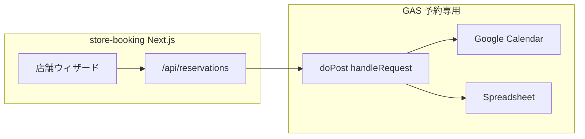

# 店舗予約（store-booking）× 予約専用 GAS — 連携設計

## ゴール

- **UI**は現状の `store-booking`（店舗端末用ウィザード）を維持する。
- **バックエンド**は **メモリー・LINE チャットを含まない予約専用 GAS**（`gas/reservation-only-user-and-store/Code.gs` を GAS に貼ったもの）と **1 本**に揃える。
- **Google カレンダー**はスクリプトプロパティの **`CALENDAR_ID` 1 つ**（店舗予約も LIFF 予約も同じカレンダーに書き込む）。
- **顧客名・ヨミ・前回予約**は **スプレッドシート**を正とし、追加・予約のたびに GAS 経由で更新・参照する。

## 構成図（データの流れ）

| 処理 | GAS action | カレンダー | スプレッドシート |
|------|------------|------------|------------------|
| 空き枠 | `getAvailability` | 参照のみ | 不要 |
| 予約確定 | `createReservation` | **作成** | `Reservations` に 1 行追加 |
| 顧客一覧（前回付き） | `listStoreCustomers` | 不要 | `StoreCustomers` + `Reservations` を結合 |
| 新規顧客 | `registerStoreCustomer` | 不要 | `StoreCustomers` に 1 行追加 |

## シート設計

### `StoreCustomers`（顧客マスタ）

| 列 | 内容 |
|----|------|
| customerId | 例 `sc-xxxxxxxx`（GAS で採番） |
| displayName | 画面表示名 |
| searchKana | 検索用ヨミ（カタカナ推奨） |
| phone | 任意 |
| createdAt / updatedAt | 監査用 |

初回: GAS エディタで **`setupStoreBookingSheets`** を実行するとヘッダ付きで作成されます。

### `Reservations`（予約ログ）

既存の 12 列に **顧客ID（13 列目）**を追加。店舗フローで `customerId` を渡したときだけ入ります（LINE 予約は空のままで可）。

前回来店の判定は **`顧客ID` が一致する行のうち最新**（または顧客 ID 未設定時は **お客様名の一致**でフォールバック）。

## 環境・デプロイの指針

1. **GAS**  
   - 正本: `gas/reservation-only-user-and-store/Code.gs` → Google の `コード.gs` に貼り付け。  
   - **メモリー用 `MemoryPage.html` は不要**（予約 only）。  
   - プロパティ: `CALENDAR_ID`（必須）, `SPREADSHEET_ID`（推奨）。

2. **store-booking**  
   - `.env.local` の `GAS_WEBAPP_URL` を **上記と同じウェブアプリ URL** にする。  
   - 親 LIFF 予約も **同じ GAS・同じカレンダー**にすれば、店舗とアプリで **二重予約防止（カレンダー空き判定）が共有**されます。

## 「データが追加されれば更新される」について

- **顧客マスタ**: `registerStoreCustomer` で行追加。一覧は **`listStoreCustomers` を画面表示のたびに fetch**（またはフォーカス時・プルダウンで再取得）すれば、スプレッドシートを直編集した内容も次回取得で反映されます。
- **前回予約**: `createReservation` のたびに `Reservations` に追記されるため、次回の `listStoreCustomers` で **最新の前回**が計算されます。
- **リアルタイム同期**: 同一店舗で複数端末を開く場合、他端末の予約を即座に一覧に出すには **ポーリング**か **手動「更新」ボタン**が簡単です（GAS に WebSocket はありません）。

## メニュー ID と GAS

GAS は **メニュー名（文字列）**を保存します。`store-booking` 側の `data/menus.ts` の **`name` と完全一致**すれば、フロントで `menuId` にマップできます。店舗でメニュー名を変えた場合は **過去行との突合せがずれる**ので、リネーム時はスプレッドシートのメニュー列を一括置換する運用を推奨します。

## 関連ファイル

- GAS: `gas/reservation-only-user-and-store/Code.gs`
- 店舗 UI: `store-booking/components/StoreBookingWizard.tsx`
- API クライアント: `store-booking/lib/reservationApi.ts`
- ダミー顧客（GAS 失敗時フォールバック）: `store-booking/data/customers.ts`
